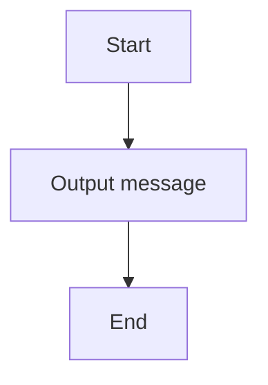

# 01 Hello World

A classic Hello World program in C#.

## 📝 Description
This program was generated from a Structorizer diagram and demonstrates basic programming concepts such as input/output and control flow.

## 📊 Logic Flow


## 💻 Code Snippet
```csharp
// Generated by Structorizer 3.32-34 

using System;
 
/// <summary>
/// </summary>
public class Just_another_hello_world
{

	/// <param name="args"> array of command line arguments </param>
	public static void Main(string[] args)
	{

		// TODO: Check and accomplish variable declarations: 

		Console.WriteLine("Hallo welt");
	}

}
```
