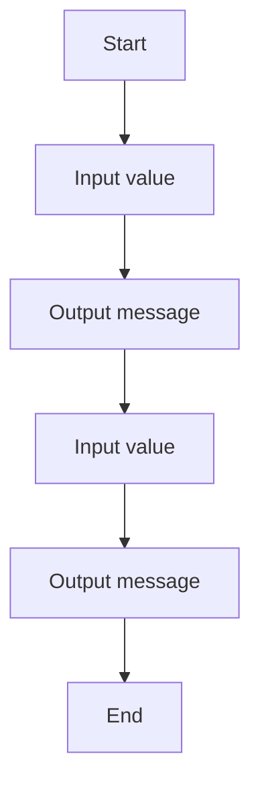

# 06 Addition With Name

A C# exercise demonstrating addition with name.

## 📝 Description
This program was generated from a Structorizer diagram and demonstrates basic programming concepts such as input/output and control flow.

## 📊 Logic Flow


## 💻 Code Snippet
```csharp
// Generated by Structorizer 3.32-34 

using System;

/// <summary>
/// </summary>
public class 05b_26-02-06
{

	/// <param name="args"> array of command line arguments </param>
	public static void Main(string[] args)
	{

		// TODO: Check and accomplish variable declarations: 
		??? B;
		??? A;

		// TODO: You may have to modify input instructions, 
		//       possibly by enclosing Console.ReadLine() calls with 
		//       Parse methods according to the variable type, e.g.: 
		//          i = int.Parse(Console.ReadLine()); 

		// zahlen 
		Console.WriteLine("Nennen Sie zwei zahlen:")
		Console.Write("A: "); A = Console.ReadLine();
		Console.Write("B: "); B = Console.ReadLine();
		// zahlen 
		// Output mit namen 
		Console.Write("Das ergebnis aus A plus B ist: "); Console.WriteLine(A+B);
	}

}
```
