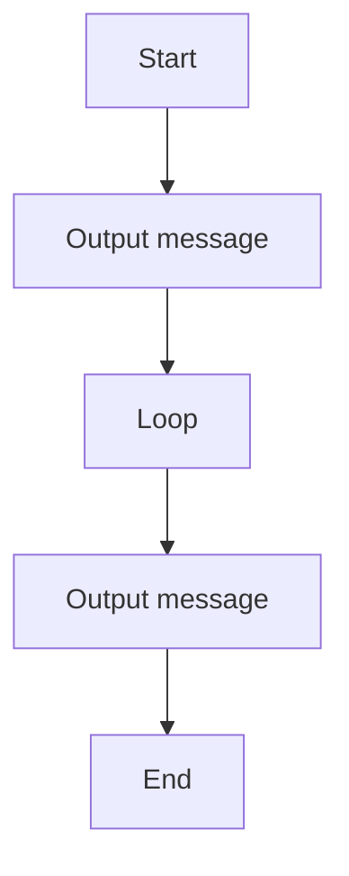

# 01 Counter 0 to 1000

A C# exercise demonstrating counter 0 to 1000.

## 📝 Description
This program was generated from a Structorizer diagram and demonstrates basic programming concepts such as input/output and control flow.

## 📊 Logic Flow


## 💻 Code Snippet
```csharp
// Generated by Structorizer 3.32-34 

using System;

/// <summary>
/// </summary>
public class 01_26-02-09
{

	/// <param name="args"> array of command line arguments </param>
	public static void Main(string[] args)
	{

		// TODO: Check and accomplish variable declarations: 
		string X;

		X = "5";
		Console.WriteLine(X);
		for (int I = 0; I <= 1000; I += (1))
		{
			Console.WriteLine(I);
		}
	}

}
```
