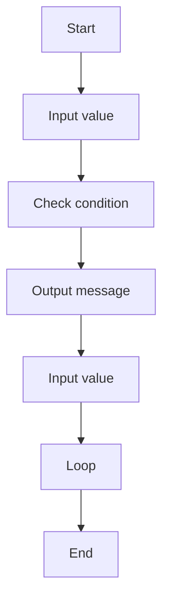

# 03 Even Odd Check Extended

A program that uses conditional logic to check a value.

## 📝 Description
This program was generated from a Structorizer diagram and demonstrates basic programming concepts such as input/output and control flow.

## 📊 Logic Flow


## 💻 Code Snippet
```csharp
// Generated by Structorizer 3.32-34 

using System;

/// <summary>
/// </summary>
public class 03_Prüfen_ob_zahl_gerade_oder_ungerade_ist
{

	/// <param name="args"> array of command line arguments </param>
	public static void Main(string[] args)
	{

		// TODO: Check and accomplish variable declarations: 
		??? zahl;
		??? antwort;

		// TODO: You may have to modify input instructions, 
		//       possibly by enclosing Console.ReadLine() calls with 
		//       Parse methods according to the variable type, e.g.: 
		//          i = int.Parse(Console.ReadLine()); 

		do
		{
			Console.Write("Bitte eine zahl angeben"); ,zahl = Console.ReadLine();
			if (zahl %2==0)
			{
				Console.WriteLine("Gerade");
			}
			else
			{
				Console.WriteLine("Ungerade");
			}
			Console.Write("Möchten Sie eine andere Zahl Eingeben? Ja/Nein"); antwort = Console.ReadLine();
		} while (! (antwort =="nein"));
	}

}
```
