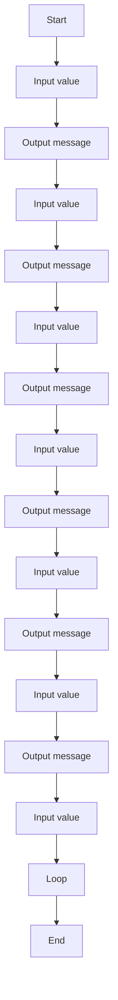

# 06 Temperature Converter Advanced

A C# exercise demonstrating temperature converter advanced.

## 📝 Description
This program was generated from a Structorizer diagram and demonstrates basic programming concepts such as input/output and control flow.

## 📊 Logic Flow


## 💻 Code Snippet
```csharp
// Generated by Structorizer 3.32-34 

using System;

/// <summary>
/// </summary>
public class 04C_Temperatur_umrechner
{

	/// <param name="args"> array of command line arguments </param>
	public static void Main(string[] args)
	{

		// TODO: Check and accomplish variable declarations: 
		??? fortsetz;
		??? eineinheit;
		??? auseinheit;
		??? Temp;

		// TODO: You may have to modify input instructions, 
		//       possibly by enclosing Console.ReadLine() calls with 
		//       Parse methods according to the variable type, e.g.: 
		//          i = int.Parse(Console.ReadLine()); 

		do
		{
			Console.Write("Welche einheit haben sie? Celsius (C) Farenheit (F) oder Kelvin (K)"); , eineinheit = Console.ReadLine();
			switch (eineinheit)
			{
			case "C":
				Console.Write("Welche einheit wollen sie berechnen? F oder K"); auseinheit = Console.ReadLine();
				switch (auseinheit)
				{
				case "F":
					Console.Write("Bitte gebe eine temperatur in grad Celsius ein"); Temp = Console.ReadLine();
					Console.Write("die temperatur von "); Console.Write(Temp); Console.Write("°C sind "); Console.Write(Temp+1.8+32); Console.WriteLine(" farenheit");
					break;
				case "K":
					Console.Write("Bitte gebe eine temperatur in grad Celsius ein"); Temp = Console.ReadLine();
					Console.Write("die temperatur von "); Console.Write(Temp); Console.Write("°C sind "); Console.Write(Temp+273.5); Console.WriteLine(" Kelvin");
					break;
				default:
					Console.WriteLine("Bitte gebe nur C (Für Celsius), F (Für Fahrenheit) oder K (Für Kelvin) an!");
				}
				break;
			case "F":
				Console.Write("Welche einheit wollen sie berechnen?"); auseinheit = Console.ReadLine();
				switch (auseinheit)
				{
				case "C":
					Console.Write("Bitte gebe eine temperatur in Farenheit ein"); Temp = Console.ReadLine();
					Console.Write("die temperatur von "); Console.Write(Temp); Console.Write("F sind "); Console.Write((Temp-32)*5/9); Console.WriteLine(" °C");
					break;
				case "K":
					Console.Write("Bitte gebe eine temperatur in Farenheit ein"); Temp = Console.ReadLine();
					Console.Write("die temperatur von "); Console.Write(Temp); Console.Write(" F sind"); Console.Write((Temp-32)*5/9+273.5); Console.WriteLine(" Kelvin");
					break;
				default:
					Console.WriteLine("Bitte gebe nur C (Für Celsius), F (Für Fahrenheit) oder K (Für Kelvin) an!");
				}
				break;
			case "K":
				Console.Write("Welche einheit wollen sie berechnen?"); auseinheit = Console.ReadLine();
				switch (auseinheit)
				{
				case "C":
					Console.Write("Bitte gebe eine temperatur in Kelvin ein"); Temp = Console.ReadLine();
					Console.Write("die temperatur von "); Console.Write(Temp); Console.Write(" K sind"); Console.Write(Temp-273.15); Console.WriteLine(" °C");
					break;
				case "F":
					Console.Write("Bitte gebe eine temperatur in Kelvin ein"); Temp = Console.ReadLine();
					Console.Write("die temperatur von "); Console.Write(Temp); Console.Write(" K sind "); Console.Write((Temp-273.15)*9/5+32); Console.WriteLine(" Fahrenheit");
					break;
				default:
					Console.WriteLine("Bitte gebe nur C (Für Celsius), F (Für Fahrenheit) oder K (Für Kelvin) an!");
				}
				break;
			default:
				Console.WriteLine("Bitte gebe nur C (Für Celsius), F (Für Fahrenheit) oder K (Für Kelvin) an!");
			}
			Console.Write("Wollen sie fortführen? (J/N)"); fortsetz = Console.ReadLine();
		} while (! (fortsetz =="N"));
	}

}
```
