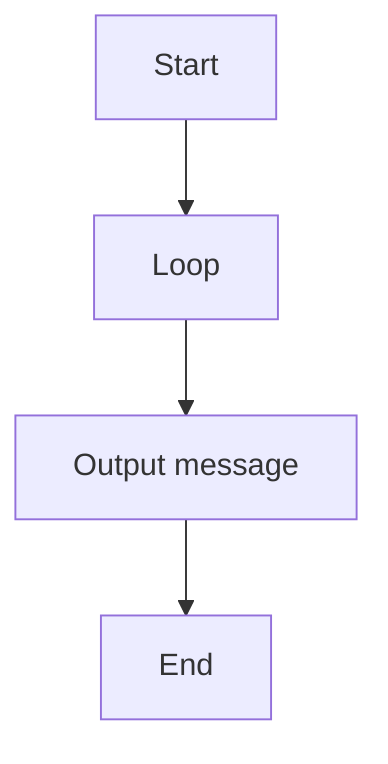

# 07 Intermediate Exam Task 7

A C# exercise demonstrating intermediate exam task 7.

## 📝 Description
This program was generated from a Structorizer diagram and demonstrates basic programming concepts such as input/output and control flow.

## 📊 Logic Flow


## 💻 Code Snippet
```csharp
// Generated by Structorizer 3.32-34 

using System;

/// <summary>
/// </summary>
public class Zwischenprüfung_aufgabe_7
{

	/// <param name="args"> array of command line arguments </param>
	public static void Main(string[] args)
	{

		// TODO: Check and accomplish variable declarations: 
		int Y;
		int X;

		X = 1;
		Y = 4;
		while (Y>0)
		{
			X = X+Y;
			Y = Y-1;
		}
		Console.WriteLine(X);
	}

}
```
