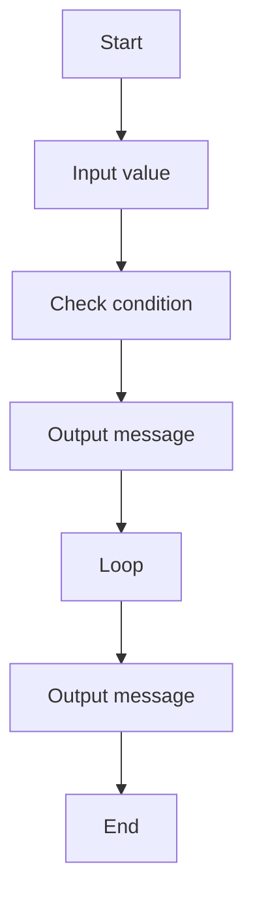

# 04 Decimal To Binary

A C# exercise demonstrating decimal to binary.

## 📝 Description
This program was generated from a Structorizer diagram and demonstrates basic programming concepts such as input/output and control flow.

## 📊 Logic Flow


## 💻 Code Snippet
```csharp
// Generated by Structorizer 3.32-34 

using System;

/// <summary>
/// </summary>
public class decimal_to_binary_calculator
{

	/// <param name="args"> array of command line arguments </param>
	public static void Main(string[] args)
	{

		// TODO: Check and accomplish variable declarations: 
		string binary;

		// TODO: You may have to modify input instructions, 
		//       possibly by enclosing Console.ReadLine() calls with 
		//       Parse methods according to the variable type, e.g.: 
		//          i = int.Parse(Console.ReadLine()); 

		dec = Console.ReadLine();
		binary = "";
		if (dec == 0)
		{
			Console.WriteLine(0);
		}
		else
		{
			while (dec > 0)
			{
				??? bin = dec%2;
				binary = bin+binary;
				??? dec = dec/2;
			}
			Console.WriteLine(binary);
		}
	}

}
```
